<p align="center">
  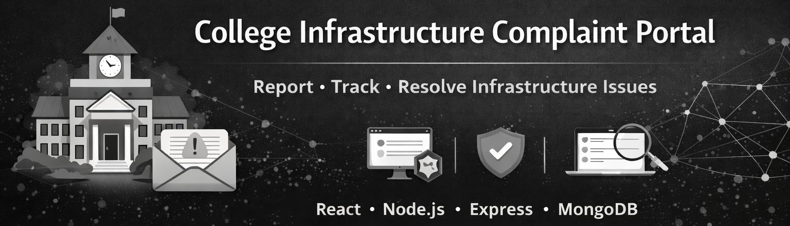
</p>

<h1 align="center">CampusCare</h1>

<p align="center">
A web platform for students to report infrastructure issues and for administrators to track and resolve complaints efficiently.
</p>


---

# 🚀 Overview

The **CampusCare** is a web-based application that allows students to report infrastructure issues within their college campus.

The system enables administrators to manage complaints, track issues, and ensure timely resolution, improving communication between students and the administration.

---

# ✨ Key Features

- 📝 Submit infrastructure complaints
- 📊 Track complaint status
- 👨‍💼 Admin dashboard for managing complaints
- 🔍 View and filter complaint records
- 🔐 Secure login system
- 📱 Responsive user interface

---

# 🖼️ Application Screenshots

### 🏠 Home Page

<p align="center">
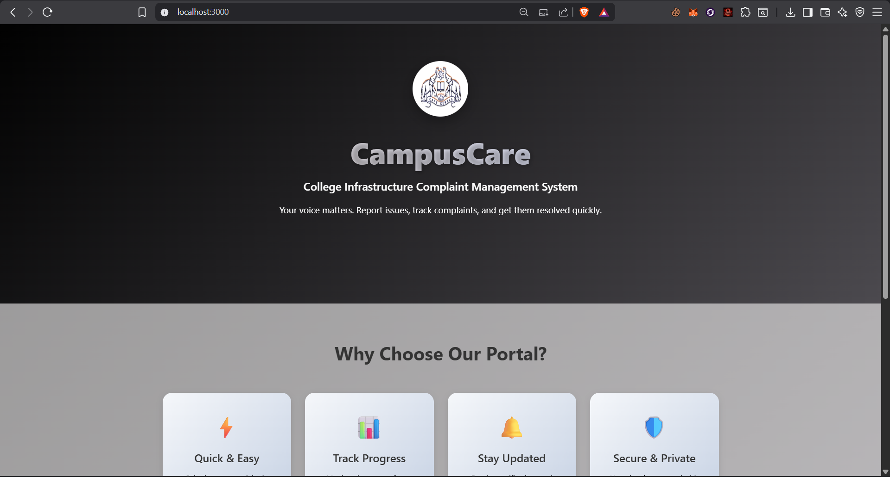
&nbsp;&nbsp;
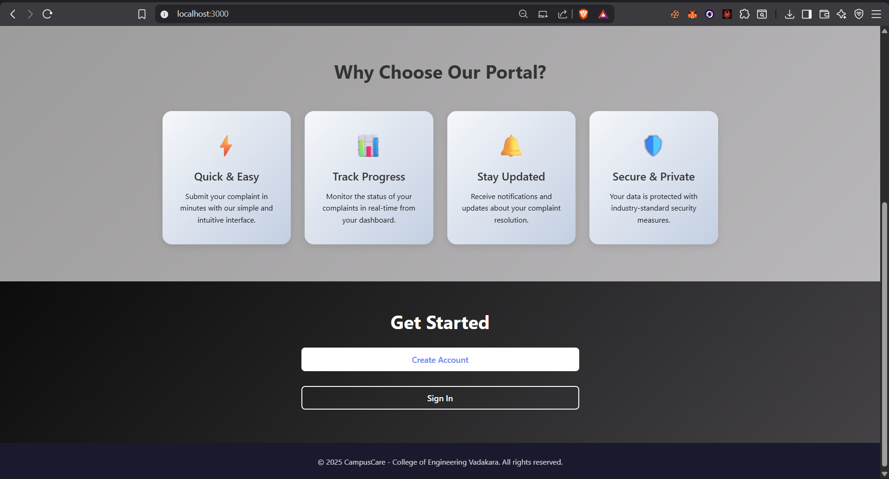
&nbsp;&nbsp;
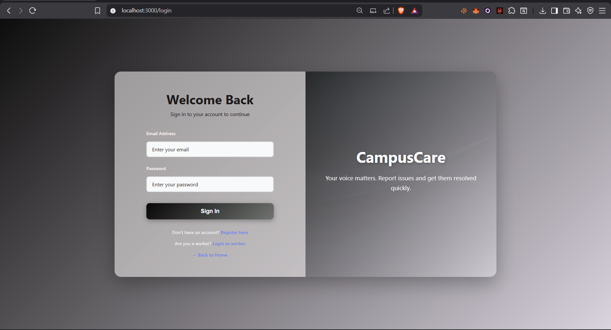
&nbsp;&nbsp;
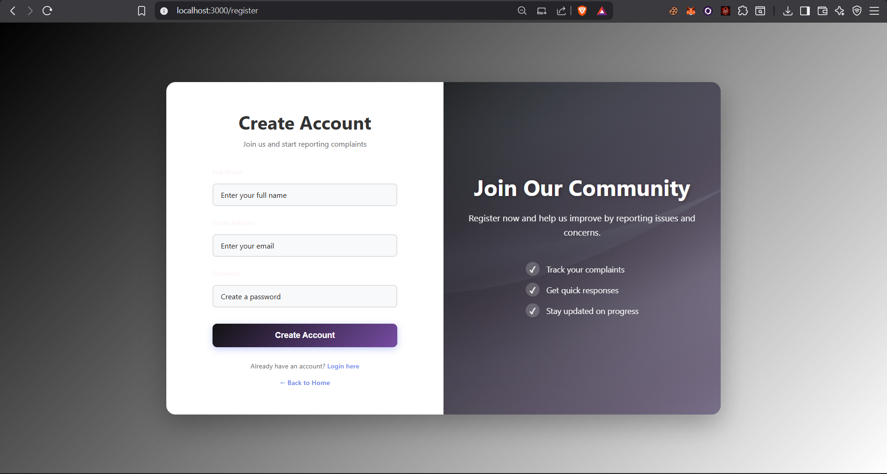
</p>

---

### Complaint Submission

<p align="center">
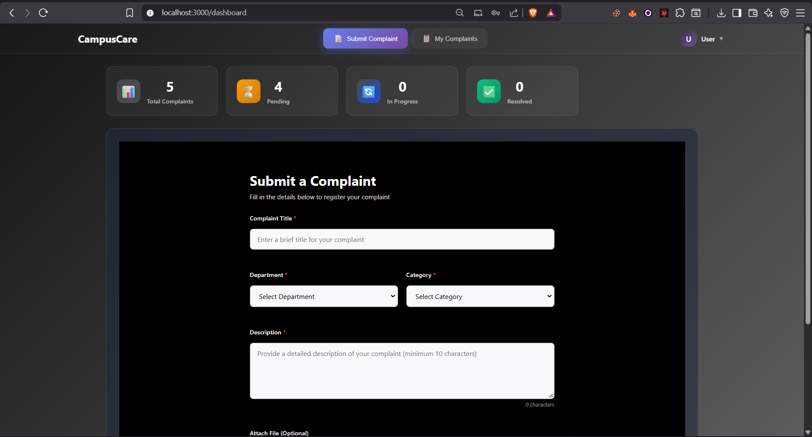
&nbsp;&nbsp;
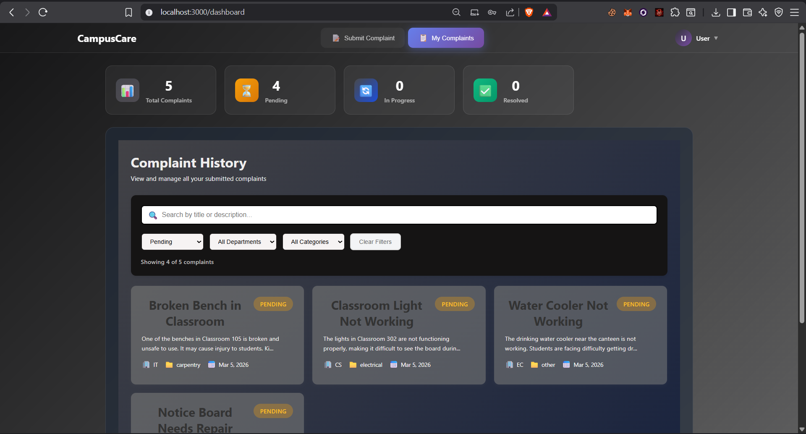
</p>

---

### Admin Dashboard

<p align="center">
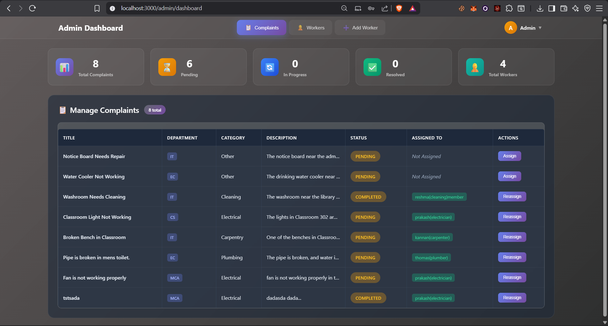
&nbsp;&nbsp;
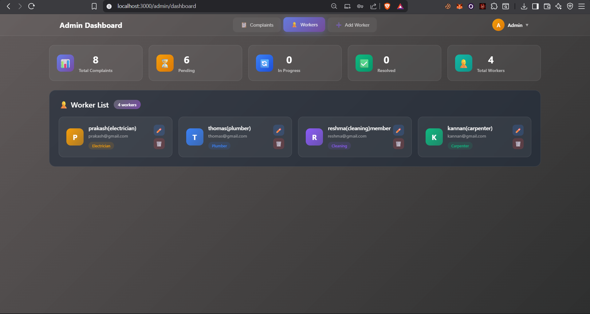
&nbsp;&nbsp;
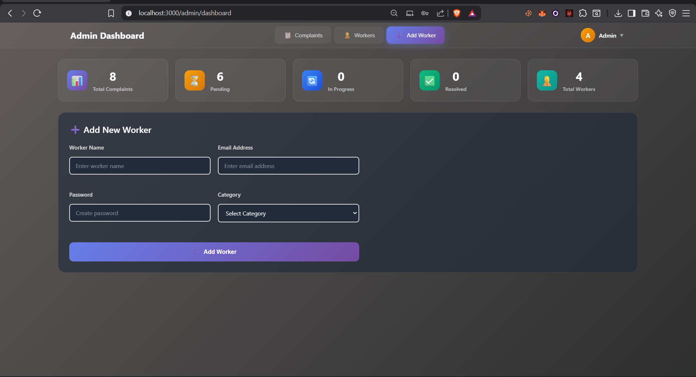
</p>

---

### Worker Dashboard

<p align="center">
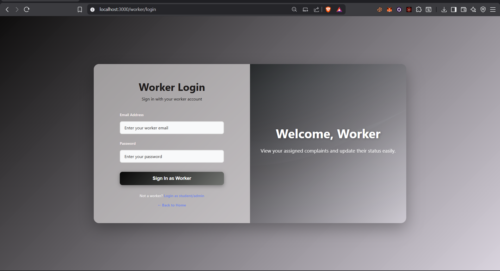
&nbsp;&nbsp;
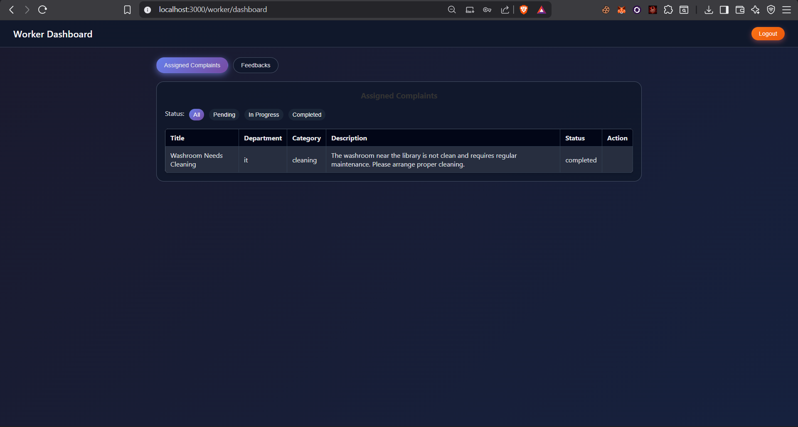
&nbsp;&nbsp;

---

# 🏗️ System Architecture

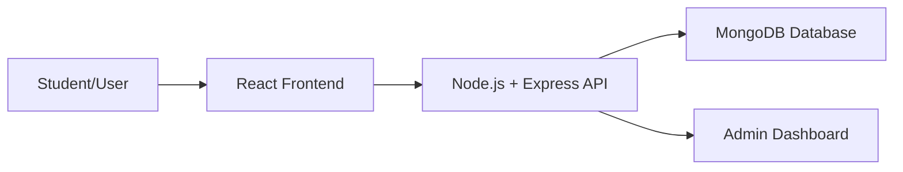
## 🛠️ Tech Stack

**Frontend**
- React.js
- HTML5
- CSS3
- JavaScript

**Backend**
- Node.js
- Express.js

**Database**
- MongoDB

**Tools**
- Git
- GitHub
- VS Code

## ⚙️ Installation & Setup

Follow the steps below to run the project locally.

### 1️⃣ Clone the Repository

```bash
git clone https://github.com/benherr/complaint-portal-MINI.git
cd complaint-portal-MINI
```

### 2️⃣ Install Dependencies

```bash
npm install
```

### 3️⃣ Start the Application
start the server
```
npm start
```
start the client
```bash
cd client/
npm start
```

### 4️⃣ Open in Browser

Visit the following URL in your browser:

```
http://localhost:3000
```
You can now start using the **CampusCare** locally.

👨‍💻 Author

Benher Basheer

<a href= "https://github.com/benherr" >GitHub</a>

<a href ="https://www.linkedin.com/in/benher-basheer-371347377/">LinkedIn</a>

⭐ Support

If you found this project helpful, please give it a ⭐ on GitHub.
